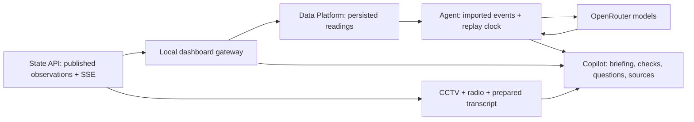

# Firewatch · Fire Incident Copilot

**A live incident workspace that turns sensor changes and radio reports into a source-linked briefing.** Built for an operator supporting incident command: see what changed, ask about the current situation, inspect the evidence, and keep unknowns visible.

[Run it](docs/QUICKSTART.md) · [Submission and demo](SUBMISSION.md) · [Live validation](dashboard/live/VALIDATION.md) · [Valencia hackathon](https://valencia.aitinkerers.org/hackathons/h_GVqIXzHKOYA)

## The interaction

1. Open a replay and press **Play**. Sensor readings, camera feeds, radio audio and timestamped transcripts arrive in the workspace.
2. **Incident Copilot** updates the briefing as new observations arrive. It separates supported observations from missing information and links claims to stored source records.
3. Ask **“What changed in Gradas, and do the available records establish whether anyone is inside?”** The answer uses the selected run, replay generation and published history. A disconnected sensor stays disconnected; an access record does not establish occupancy.
4. Open a cited source to inspect the reading or radio utterance, including its time and provenance. Hear the original audio when available. The operator remains responsible for the command briefing.

The workspace supplies source identity, location, replay time, device availability and published observations before the question is typed. The operator does not have to collect and paste a stream into a chat window. Automatic briefings and follow-up questions share that context.

## What runs today

| Component | Working behavior |
|---|---|
| Live dashboard | English interface, prominent Copilot, two CCTV views, radio playback/transcripts, sensor metrics, searchable events, evidence viewer and replay controls |
| Stream pipeline | State snapshot/history plus SSE; persists observations through Platform REST and imports the returned reading IDs into the agent |
| Agent | OpenAI Agents SDK, typed radio extraction and situation/question answers, durable SQLite work, channel request/assignment/acknowledgement checks |
| Inference | OpenRouter; current configuration uses `google/gemini-3.1-flash-lite`, with `openai/gpt-5.6-luna` as fallback |
| Data Platform | FastAPI, PostgreSQL and Redis; ingestion, REST, SSE and MCP interfaces. The current dashboard pipeline uses REST, not model-selected MCP calls |
| Recovery and control | Pause/replay, generation isolation after seek/reset, persisted import journal, question cancellation and bounded model fallback |



The application controls retrieval, event ordering and state transitions. Models extract and explain evidence; they do not autonomously dispatch crews, operate equipment or select tools. Source links make answers inspectable, not automatically correct.

## Quickstart without credentials

Prerequisites: Git, Python 3.12+, [uv](https://docs.astral.sh/uv/), Node.js 18+ and npm for verification. No frontend dependency installation is required.

```bash
git clone https://github.com/Anastassy/fire-incident-copilot.git
cd fire-incident-copilot
uv sync --project agent-service --locked
npm run verify
FIRE_ENGINE=fixture python3 dashboard/live/run_local.py
```

Open **http://127.0.0.1:8790/**. Keep ports 8010 and 8790 free before starting: the launcher reuses an existing agent on 8010 if one is running. Use **Request → Assign channel → Acknowledge** in the fixture controls to inspect a check and its sources.

This is a **deterministic, synthetic agent demonstration**: no model calls or datasets are needed. Without State credentials, cameras/radio are unavailable and the State section reports missing credentials. The fixture does not analyze a State replay that happens to be displayed alongside it.

## Run the live demo

Follow the [English live quickstart](docs/QUICKSTART.md#live-stream-and-model-analysis) for exact commands and private configuration files.

You need a running State API with read/control tokens, a local or hosted Data Platform with its API key, and an OpenRouter API key. Start **two local processes**: the SDK agent on 8012 and the dashboard gateway on 8790. A local Platform adds Docker services; a hosted Platform does not. Full media streams come from the separately deployed State service and are not bundled in a clean clone.

The gateway imports the stream itself. Do not start another bridge for the same run. Create a new run for your demonstration, or coordinate before controlling an existing shared run. Keep credentials in backend environments or private files outside this repository.

## Verification and limits

`npm run verify` runs offline checks: **15 JavaScript tests, 23 gateway/pipeline Python tests, 74 agent tests**, plus design adapter assertions. It does not start a production service, call a model or run the Platform database suite.

The [September 12 live validation](dashboard/live/VALIDATION.md) separately records State → Platform → SDK agent → browser playback, automatic briefings, cited answers, audio, pause/reconnection and replay generation isolation. Fallback error/cancellation paths are tested with mocks; both configured models were also called successfully. Forced provider failover during browser replay was not demonstrated.

- **Composite training scenario:** synthetic Base2 building/CCTV material and independent historical Palisades radio share a replay clock. They are not evidence of the same real incident.
- **Camera and audio scope:** cameras are visible to the operator; the model does not analyze their pixels. Radio comes with a prepared machine transcript, not new speech recognition in this service.
- **Bounded context:** answers use up to 20 selected events from the latest 500 candidates, with a 24,000-character limit. This is not full-incident recall.
- **Timing:** a three-second analysis interval is scheduling, not an end-to-end latency guarantee. Recorded measurements are a short sample, not an SLA or accuracy evaluation.
- **Deployment:** State and Platform were exercised on hosted services; the dashboard and agent are local processes. There is no public, credential-free hosted UI in this release.
- **Decision support:** unknown occupancy remains unknown. This prototype is not certified detection, emergency dispatch or autonomous incident command.

## Two-minute demonstration

The current **Sharp S6** cut is 120 seconds, 1920×1080, with English narration, original radio audio and visible synchronized subtitles. It uses actual interface captures edited to the narrative, not a continuous latency benchmark.

[Production sources](dashboard/video/s6/README.md) · [Final file verification](dashboard/video/s6/verification.sharp.reference.json) · [Script](dashboard/VIDEO_SCRIPT.md)

**Public video URL: pending publication.** This repository contains production sources and manifests, not the final MP4. Earlier 25-second videos in the repository are historical introductions, not the submission film. [SUBMISSION.md](SUBMISSION.md) tracks the remaining external links.

## Repository guide

- [Current interface, gateway and pipeline](dashboard/live/README.md)
- [Agent implementation, API and durable runtime](agent-service/README.md)
- [Telemetry backend, Docker, REST/SSE/MCP and migrations](platform/README.md)
- [Radio package and source attribution](data/demo/palisades-radio-demo/README.md)

- [Current project context](dashboard/PROJECT_CONTEXT.md)
- [Problem, business case and preserved calculations](dashboard/BUSINESS_CASE.md)
- [Evidence Bank](dashboard/EVIDENCE_BANK.md)
- [Multi-source MVP scenario and acceptance](dashboard/MVP_SCENARIO.md)
- [Document audit and preserved originals](dashboard/DOCS_AUDIT.md)

## Build history and attribution

This is a custom stack; the CopilotKit starter application is not part of the runtime. Its [hackathon guidance](https://github.com/CopilotKit/agents-everywhere-starter-kit) informed the submission documentation. The [build disclosure](SUBMISSION.md#build-history-and-eligibility) separates earlier research/simulation preparation from September 12 integration work; Git import dates alone do not establish eligibility.

**Audio Provided by Broadcastify.** The [source package](data/demo/palisades-radio-demo/README.md) records the original recording, machine transcript and CC BY 3.0 US attribution. Synthetic Base2 data is not a reconstruction of Palisades. Dataset licenses do not automatically license project code. No validated reduction in response time, casualties or loss of life is claimed.
