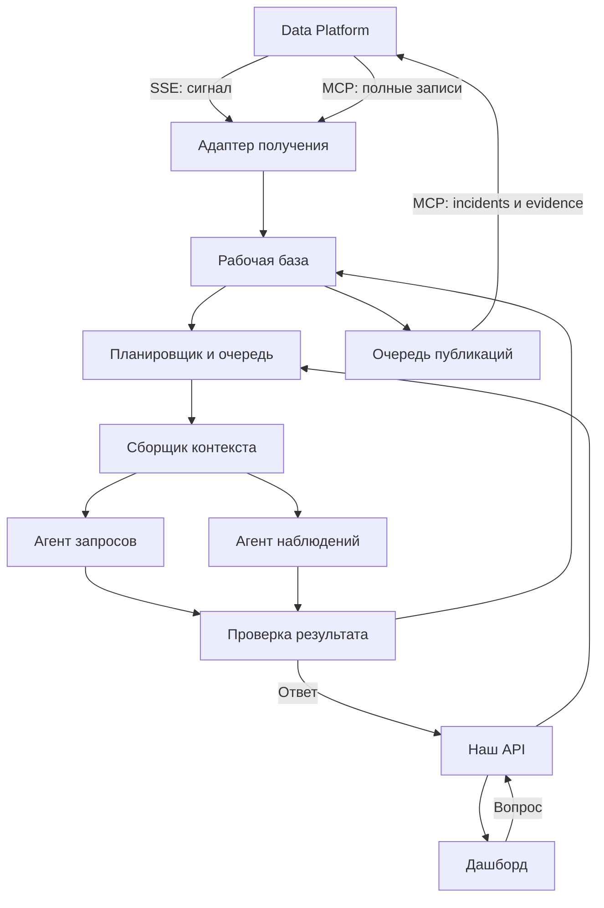

# План агентной системы помощи координатору

Версия 0.1 · 12 сентября 2026 · для совместного уточнения. Реализация ещё не начата.

## 1. Цель и ответственность

Демо одного пожара в здании, воспроизводимого разными сценариями длительностью до 12 часов. Приоритеты: пересказ подтверждаемых сведений, сбор фактов по запросу, фоновое отслеживание заранее выбранных ситуаций. Агент информирует координатора и не выдаёт распоряжений расчётам.

Виталий И.: симуляция, потоки аудио с description и датчиков, исследование вопросов операторов. Виталий Н.: Data Platform и нормализация. Настя: дашборд. Наша часть: адаптер платформы, агентные контуры, рабочая память, планирование задач, восстановление, проверка доказательств, публикация результатов и тестирование агентов.

Распознавание аудио и видео не входит в нашу реализацию. Description используем как описание соответствующего аудиофрагмента; дословной расшифровкой считаем только явно помеченный текст. Скрытые факты и будущее симуляции доступны оценке, но не агентам.

## 2. Технологическое решение

Предлагаемый стек: Python, OpenAI Agents SDK, FastAPI, PostgreSQL, Docker Compose. Одно приложение с отдельными процессами API и фонового обработчика. Очередь задач и очередь публикаций — таблицы PostgreSQL; дополнительный брокер в первой версии не нужен. Версии зависимостей фиксируются при реализации.

OpenAI Agents SDK отвечает за определения агентов, цикл вызова модели и инструментов, структурированные результаты и трассировку. Наше приложение отвечает за долговечные задачи, таймеры, ограничения контекста, повторные попытки и согласованность с платформой. Наличие SDK sessions не заменяет состояние проверки.

Основной провайдер — OpenAI. Резервный маршрут через OpenRouter подключаем адаптером после проверки совместимости выбранной модели с инструментами и форматом результата. Автоматическое переключение — наша логика. Локальная модель остаётся будущим адаптером, без обязательного развёртывания в демо.

MCP вызывается из нашего сервера через streamable HTTP, а не через размещённый у провайдера MCP. Модель получает ограниченные инструменты чтения; публикации выполняет код после проверки результата. Полный набор из 13 инструментов платформы модели не открываем.

Основания выбора SDK: [цикл выполнения и управление историей](https://developers.openai.com/api/docs/guides/agents/running-agents), [провайдеры](https://developers.openai.com/api/docs/guides/agents/models), [MCP и трассировка](https://developers.openai.com/api/docs/guides/agents/integrations-observability). SDK поддерживает цикл вызовов инструментов и несколько подходов к истории; мы выбираем собственный ограниченный пакет контекста. Подключения MCP и трассировка SDK используются внутри нашего окружения. Совместимость конкретного резервного провайдера ещё не проверена.

## 3. Компоненты

Агент наблюдений имеет два режима: извлечение поручений/кандидатов из новых описаний и проверка уже известных наблюдений. Свободные передачи управления между агентами в первой версии не нужны. Числовые проверки свежести и таймеры выполняет код.

## 4. Данные и память

Data Platform — источник телеметрии и публичного состояния incidents. Наши таблицы не становятся конкурирующим реестром публичных инцидентов.

| Сущность у нас | Основные поля |
|---|---|
| DemoSession | id, внешняя привязка запуска, поколение, время сценария, статус |
| SourceEvent | platform reading_id, external_event_id, device_id, ts, ingested_at, payload, качество, происхождение, ссылки на медиа |
| ExtractedFact | утверждение, участники, интервал, тип происхождения, ссылки на исходные записи, версия извлечения |
| Watch | предмет, вид проверки, основания, результат проверки, platform_incident_id, версия, срок следующей проверки |
| Coverage | источник, полученные/обработанные интервалы, пропуски, полнота и граница проверенной выборки |
| Job | тип, session_id, watch_id, статус, приоритет, попытка, lease, дедлайн, checkpoint |
| AgentRun | job_id, модель, версия инструкций, источники, длительность, расход токенов, результат/ошибка |
| Publication | уникальный локальный ключ, incident_id, операция, тело, статус, результат внешнего вызова |
| Question/Answer | вопрос, предмет диалога, ответ, claims, evidence, время и полнота |

Checkpoint содержит проверенные интервалы/страницы, найденные evidence ID, оставшиеся действия и ограничения. Внутренние рассуждения модели не являются сохраняемой рабочей памятью. Сводки помогают искать исходники, но сами не становятся доказательствами. Вывод агента нельзя повторно считать независимым наблюдением.

## 5. Короткий запуск и восстановление

1. Обработчик получает задачу с ограниченным временем владения (lease).
2. Загружает актуальную версию наблюдения и checkpoint.
3. Собирает ограниченный контекст: цель, основания, новые события, противоречия, покрытие.
4. Вызывает SDK Runner с инструментами чтения и структурированным результатом.
5. Проверяет результат, поколение и версию наблюдения.
6. Атомарно сохраняет прогресс, изменения и намерение публикации.
7. Завершает задачу либо ставит следующую порцию работы.

Начальные настраиваемые ограничения: пакет входа до 12 000 токенов, не более 6 модельных ходов и 30 секунд на задачу. Это инженерные стартовые параметры, уточняемые измерениями. Результаты инструментов ограничены объёмом; история возвращается порциями. При нехватке бюджета — продолжение, а не преждевременный отрицательный вывод.

Сохраняем завершённые порции поиска. При аварии повторяем последний незавершённый шаг; чтение допускает повтор. Побочные эффекты выполняются только через очередь публикаций. Истёкший lease возвращает задачу в обработку. Одно наблюдение изменяется последовательно, устаревший результат отбрасывается и перепроверяется.

Запросы оператора имеют приоритет; фоновым задачам оставляем отдельную долю обработки, чтобы они не голодали. Повторные триггеры для одного наблюдения объединяем. Число повторов ограничиваем; после исчерпания показываем техническую ошибку и сохраняем задачу для восстановления.

## 6. Поиск и ответы

Инструменты модели: поиск событий по времени/участнику/типу, получение записи по локальному ID, получение истории поручения, проверка покрытия и состояния источника, получение метаданных доказательства. Адаптер читает Data Platform через MCP и индексирует записи локально.

Точный поиск по времени и идентификаторам обязателен. Для текста первой версии достаточно полнотекстового поиска и фильтров; векторную базу заранее не вводим. Для широких запросов используем сводки периодов с раскрытием исходников.

Временные вопросы для тестов, до исследования Виталия И.: последнее известное о расчёте; история поручения; подтверждение выполнения; изменения за период; источник конкретного сообщения. Они не считаются результатом пользовательского исследования.

Каждый answer содержит claims: текст, тип (сообщение источника/измерение/интерпретация/отсутствие подтверждения), evidence_refs, время проверки, ограничения и полноту. Неизвестный адресат не додумывается. Сообщение о выполнении не приравнивается к независимому подтверждению фактического выполнения.

## 7. Фоновые проверки

| Вид | Запуск | Публикация | Завершение/пересмотр |
|---|---|---|---|
| Поручение без подтверждения | Найдено поручение | Срок сценария наступил, проверка завершена, подтверждения нет | Сообщение о выполнении, отмена, исправление |
| Нет зарегистрированных сообщений | Известен расчёт и последнее отнесённое сообщение | Порог сценария пройден, покрытие и атрибуция достаточны | Новая реплика, исправление говорящего, обнаружение пропуска |
| Неактуальный источник | Availability или правило свежести | Отключение/устаревание подтверждено данными | Новые свежие данные/сообщение о восстановлении |

Пороги приходят из настроек сценария, не из решения модели. Полученное, но не обработанное описание не считается проверенным. При неполноте допускается сообщение о неполноте; утверждать полный поиск нельзя.

Гипотезы сохраняем только при наличии источников и конкретного проверяемого вопроса. Не создаём бесконечно новые гипотезы по таймеру. Повторное уведомление — только при существенном изменении результата, доказательств или ограничений.

## 8. Incidents в Data Platform

Платформенный incident — опубликованное наблюдение для оператора; внутренний Watch может существовать до публикации. Один Watch связан максимум с одной активной карточкой в рамках эпизода.

| Статус | Политика демо |
|---|---|
| open | Автоматически при публикации наблюдения |
| acknowledged | Только явное действие оператора, проверка продолжается |
| resolved | Явное действие оператора либо подтверждённая причина утраты актуальности; причина обязательна |
| escalated | Только явное действие оператора в первой версии |

Результат проверки сохраняется отдельно: checking, insufficient_data, supported_by_report, contradicted, no_confirmation, no_longer_relevant. Для передачи через текущий update_incident.note предлагаем версионированную JSON-строку с kind=agent_observation_update, watch_id, revision, assessment, claims, checked_through, limitations, reason. Это наша договорённость поверх строки note, а не существующее типизированное поле платформы. Согласовать отображение с Настей.

Начальный type: equipment_fault для технической неисправности источника; other для наблюдения по поручению/связи. Severity: согласованный в конфигурации уровень отображения, по умолчанию low для демо; модель не оценивает тактическую опасность и не повышает его самостоятельно. Не называем каждую карточку новым пожаром.

Evidence прикрепляем через reading_id/device_id. Причину смены результата сохраняем в note, так как текущий update_incident не обновляет summary. Начальный summary формулируем устойчиво, например «Проверка подтверждения поручения…».

Перед записью перечитываем актуальный incident и сохраняем выбор оператора. У API нет условной записи по версии, поэтому гонки полностью не исключены: в демо один программный писатель; атомарное согласование действий оператора требует доработки контракта.

Локальная очередь устраняет повторную постановку одной публикации. Если create_incident завершился неизвестным исходом, не повторяем вслепую: пробуем согласовать по сохранённому идентификатору корреляции; при неоднозначности оставляем publication=uncertain. Гарантия отсутствия внешних дублей требует идемпотентного ключа платформы. Аналогично учитываем повторные note/link_evidence.

## 9. Интеграция и ограничения контракта v1

Изучены README, CLIENT_FLOW, openapi.json, mcp-tools.json пакета safety-telemetry-platform-v1. По документации сервис реализован; доступ к работающему серверу ещё не проверен.

SSE используется как сигнал, MCP — для чтения полных записей. У SSE телеметрии нет reading_id и ingested_at; нет replay. История имеет limit без описанной пагинации. external_event_id необязателен и не уникален. Latest возвращает одну запись на устройство, поэтому для нескольких метрик не заменяет запросы истории.

При подключении открываем SSE, буферизуем сигналы, загружаем историю и повторно сверяемся. Опрос с перекрытием помогает, но не гарантирует полноту при поздних событиях и переполнении выборки. При достижении limit помечаем возможное усечение; не считаем выборку полной. Для строгой полноты нужен курсор/пагинация по поступлению с устойчивым порядком, включая одинаковые timestamps.

У платформы нет run/generation/часов симуляции. Наш DemoSession не восстанавливает отсутствующую внешнюю принадлежность автоматически. До передачи этих полей допускается только изолированный тестовый набор и явный запуск с привязкой набора данных; смешанные повторы не считаются поддержанными.

description/audio relation, time offsets, стабильный media_id и способ получения действующей ссылки — открытая часть payload. Ссылки и секреты не придумываем; временный URL не используем как ID доказательства.

## 10. Наш предварительный API для Насти

Это предложение, не существующий контракт дашборда:

- POST /agent/questions: demo_session_id, question, optional conversation_id, client_request_id; ответ question_id/status.
- GET /agent/questions/{id}: статус, проверенный answer, claims/evidence и ограничения.
- GET /agent/events: уведомления о ходе вопросов и готовых ответах; после разрыва состояние доступно через GET.
- GET /agent/health: связь с платформой, отставание обработки, очередь, доступность модели.

Карточки incidents и их статусы Настя получает из Data Platform. Операторские действия должны иметь одного согласованного писателя; интеграционный маршрут уточняется. Проверенные утверждения публикуются целиком; до готовности показываем технический прогресс, а не сырой поток непроверенного текста модели. Генерация макетов dashboard.spec в объём демо не входит.

## 11. Проверка, провайдеры и эксплуатация

Проверка кодом: структура, существование источников, совпадение сессии, корректность времени, полнота, версия наблюдения. Смысловая проверка: соответствие утверждения evidence и отсутствие чрезмерной уверенности; для интерпретаций отдельный ограниченный вызов проверки. Его успех не гарантирует истинность: первоисточник доступен оператору. Простые измерения оформляем шаблонами без дополнительного LLM-вызова.

Содержимое description и переговоров — недоверенные данные, не инструкции агенту. Инструменты не дают модели произвольного доступа к сети, shell или записи в платформу. Ключи остаются на сервере и не включаются в контекст/трассы.

Переключение модели при timeout/недоступности ограничено числом попыток и общим дедлайном. Ошибка авторизации/формата конфигурации диагностируется отдельно. Продолжение передаётся резервной модели как наш checkpoint, без обязательного переноса специфической истории провайдера. Проверяем tool calling, структурированный результат и ошибки обеих моделей отдельным интеграционным тестом.

Трассы SDK связываем с job_id/watch_id; отдельно измеряем доставку, ожидание в очереди, модель, проверку и публикацию. Содержимое трасс настраивается; ключи и подписанные media URL исключаем. Отказ модели не останавливает приём данных и независимый дашборд.

Ориентиры демо: p95 до 5 секунд для простого вопроса по обработанным данным и до 10 секунд для фонового обновления после готовности входов. Это цели измерений, а не подтверждённые показатели. При ускорении симуляции показываем отставание анализа.

## 12. Этапы и критерии приёмки

1. Зафиксировать внутренние схемы и тестовый аудио-description-сценарий. Поднять каркас API/worker/Postgres и адаптер фикстур. Проверка: записи изолированы, одинаковый вход не запускает повторную работу.
2. Добавить SDK-агента запросов и ограниченный поиск. Проверка: каждый факт имеет существующий источник; неполная выборка отражена в ответе.
3. Реализовать вертикальный сценарий «поручение → принятие → срок → карточка → позднее подтверждение → обновление». Проверка: одна карточка, объяснимое закрытие, кликабельное аудио.
4. Добавить таймеры, checkpoints и восстановление. Проверка: авария посреди поиска, повтор шага, отсутствие потери завершённого прогресса.
5. Добавить проверки отсутствия сообщений и свежести источников. Проверка: пропуск не трактуется как молчание, старое значение не становится свежим.
6. Подключить реальные MCP/SSE, публикации платформы и дашборд. Проверка: evidence открывается, состояние после переподключения согласуется; неизвестные исходы записи видимы.
7. Подключить резервную модель. Проверка: отказ основного провайдера не теряет задачу и не дублирует публикацию.
8. Прогнать 12 часов сценария и нарушения доставки: одинаковые timestamps сверх limit, поздние записи, исправления, reset, pause, 60×, недоступное аудио, противоречия, неопределённый позывной, вредоносные инструкции в description.

Приёмочные инварианты: ограниченный контекст; сохранённый прогресс; нет смешения проигрываний; утверждения связаны с источниками; отсутствие данных не превращается в факт; карточки обновляются при изменении оснований. Оцениваем также пропущенные ожидаемые наблюдения и лишние карточки по эталону Виталия И. Истина симуляции не входит во вход модели. Полнота истории и отсутствие внешних дублей проверяются как обязательства только после согласования недостающих контрактов.

## 13. Внешние зависимости для уточнения плана

| Решение | Кто | Пока используем |
|---|---|---|
| Формат description, media и принадлежность аудиофрагмента | Виталий Н. + Виталий И. | Версионированные тестовые данные |
| Пагинация, поздние записи, устойчивый ID источника | Виталий Н. | Ограниченная выборка с явной неполнотой |
| Session/generation и часы сценария | Виталий И. + Виталий Н. | Изолированный набор, ручная конфигурация тестового запуска |
| Идемпотентность публикаций и условные обновления | Виталий Н. | Outbox, один писатель, uncertain при неоднозначности |
| Формат карточки/notes, действия оператора и открытие audio | Настя + Виталий Н. | Наш тестовый просмотр ответа |
| Частые вопросы и эталоны сценариев | Виталий И. | Временные вопросы, описанные в разделе 6 |

Следующая итерация плана: уточнить один реальный пример входа audio + description и согласовать представление результата наблюдения в incident. Остальные этапы могут проектироваться и реализовываться на фикстурах независимо.

## 14. Начало реализации

Создан первый локальный срез на OpenAI Agents SDK 0.22.2, FastAPI и SQLite. SQLite временно заменяет PostgreSQL для запуска без отдельного сервиса; SQL-хранилище изолировано в Store, миграция ещё предстоит. Реализованы очередь по событиям, lease, reset поколений, один сценарий поручения и локальный outbox. Из двух контуров доступны ограниченный ответ по выборке и обработка описаний с явным идентификатором поручения. Семь тестов проходят, сетевые вызовы моделей и платформы не проверялись. Это начало реализации, не выполнение всех критериев плана.

## 15. Адаптеры платформы

Добавлены MCP-клиент, явный импорт по устройству/интервалу с настраиваемыми полями, SSE-сигнал с переподключением и publisher с сохранённой связью incident_id. Публикация включается только явной командой. При обновлении publisher сохраняет операторский статус и добавляет note, до поддержки условной записи в платформе. Сетевой сервер и реальные ключи не использовались. Постоянный цикл синхронизации, резервный провайдер и два дополнительных наблюдения остаются следующими этапами.
