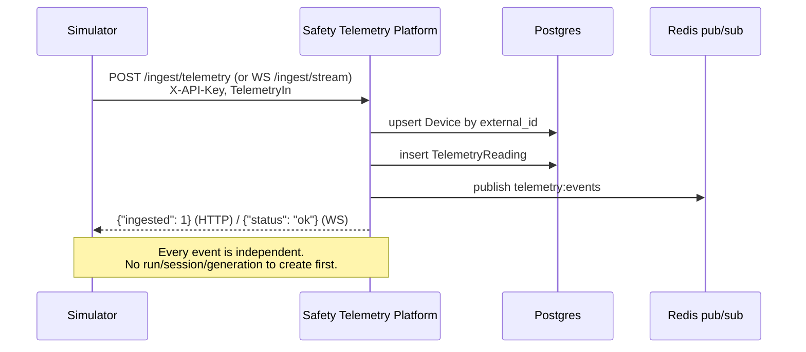
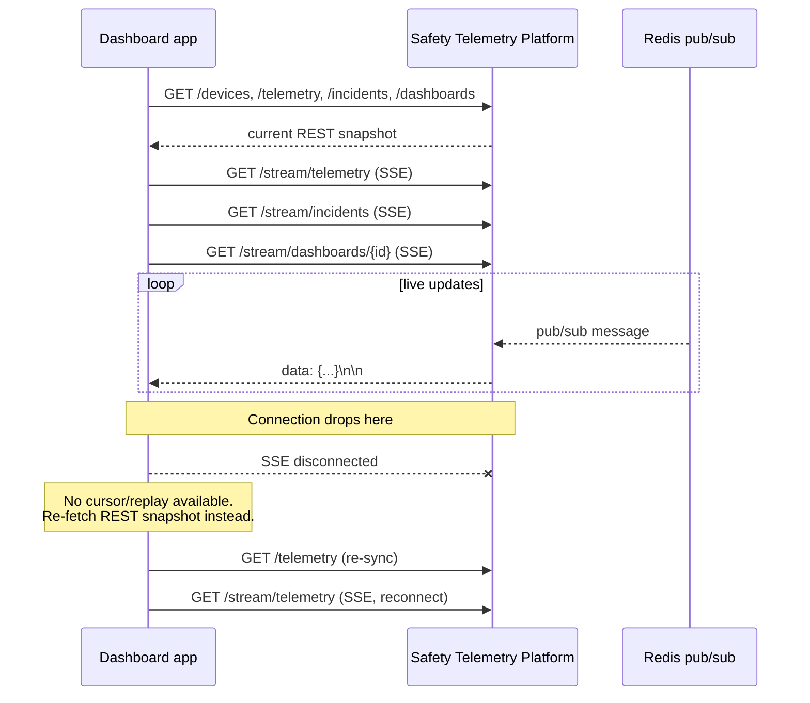
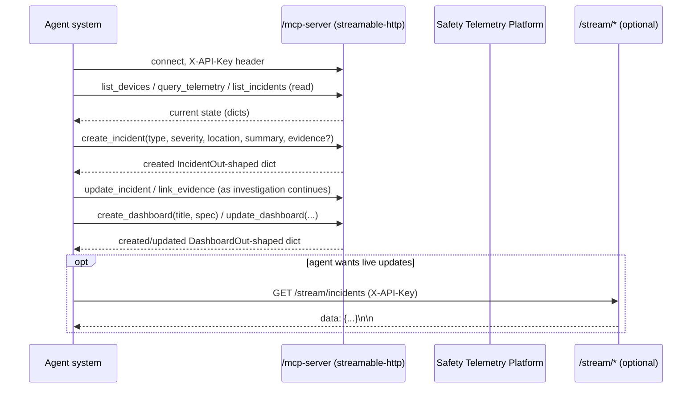

# Client integration flow

All three roles talk to the same running service at `http://localhost:8000` (configurable)
with an `X-API-Key` header on every request. There is no run/session/generation/cursor
concept anywhere in this platform — every telemetry event, incident, and dashboard write
is independent and immediately durable. Pick your section below.

- [Simulator team — push ingestion](#simulator-team--push-ingestion)
- [Dashboard team — pull REST + push SSE](#dashboard-team--pull-rest--push-sse)
- [Agent-system team — MCP](#agent-system-team--mcp)

---

## Simulator team — push ingestion

You own sensor/camera/CCTV/alarm data generation. You push it in; the platform persists it
and fans it out. There is nothing to "connect to" beyond an HTTP or WebSocket endpoint —
no run to create, no scenario to pick, no play/pause.

### First connection

1. Pick a transport: `POST /ingest/telemetry` for one-shot or batched HTTP posts, or
   `WS /ingest/stream` for a persistent connection sending one `TelemetryIn` JSON object
   per message. Both accept the identical payload shape and write path.
2. Send `TelemetryIn`: a `device` envelope (`external_id`, `type`, optional `name`/`location`)
   plus the reading itself (`metric_type`, `ts`, optional `end_ts`/`value`/`unit`/`payload`,
   and the optional quality/provenance fields below). See
   [examples/ingest-telemetry-request.json](examples/ingest-telemetry-request.json).
3. The device is **upserted by `external_id`** on every event — first sight creates it
   (`status=online`), every subsequent sight refreshes `name`/`location`/`status=online`/
   `last_seen_at`. You never register a device up front.
4. HTTP responds `{"ingested": <n>}` for the batch; WS responds `{"status": "ok"}` or
   `{"status": "error", "detail": "..."}` per message, on the same connection.
5. Retries are safe: re-upserting the same `external_id` is idempotent by design. There is
   **no dedupe on the reading itself** yet — posting the identical event twice creates two
   rows. If you need to detect/reconcile your own retries or replays, set the optional
   `external_event_id` field to an opaque id from your own system; the platform stores it
   verbatim (indexed) but does not enforce uniqueness on it in this version — dedup logic on
   that field is on the consumer side for now.
6. Optional fields worth setting when you have the data: `quality` (`valid`/`missing`/`invalid` —
   quality of the source value itself) and `availability` (`fresh`/`stale`/`missing`/`invalid`/
   `disconnected` — freshness/connectivity of the device at observation time). Both are
   passed straight through to REST/SSE/MCP consumers.

### Notes

- `metric_type` is an open-ish enum: `temperature`, `smoke`, `water_level`, `motion`,
  `video_event`, `heartbeat`, `other`, `access`, `occupancy`, `radio_audio`, `system`,
  `obscuration`, `co`, `eco2`. Use `end_ts` only for events with a duration (e.g. `motion`);
  leave it `null`/omitted for point events.
- `provenance` is a free-form dict — put source dataset id, original recorded time, or
  origin type (`recorded`/`synthetic`/`derived`/`human_report`) in it; the platform does not
  interpret it, just stores and forwards it.
- There's no backpressure/ack beyond the per-message response — if you need guaranteed
  delivery, treat a missing/erroring response as a retry signal.

---

## Dashboard team — pull REST + push SSE

You render device/telemetry/incident/dashboard state. Two complementary ways to get it:
REST for point-in-time snapshots, SSE for live updates. There is no combined "connect once,
replay history, then get live events without gaps" model here — that's the single biggest
difference from other event-sourced contracts you may have seen (like the sensor
simulator's own draft contract), and it's a deliberate hackathon-scope tradeoff. Read the
**Known limitation** below before you build reconnect logic.

### First connection

1. `GET /devices`, `GET /telemetry` (or `/telemetry/latest`), `GET /incidents`,
   `GET /dashboards` each give you the current REST snapshot, with query-param filters
   (`type`, `status`, `building`, `floor`, `zone`, `device_id`, `metric_type`,
   `since`/`until`, `limit`, etc. — see [openapi.json](openapi.json) for the exact set per
   endpoint). Use these to paint the initial screen.
2. In parallel, open `GET /stream/telemetry`, `GET /stream/incidents`, and
   `GET /stream/dashboards/{dashboard_id}` as SSE connections (`X-API-Key` header, plain
   `text/event-stream`, no query params — there's no channel filtering server-side, filter
   client-side if you only care about a subset).
3. Apply incoming SSE messages as incremental updates on top of the REST snapshot you
   already have (upsert by `id`/`device_id` as applicable).
4. If your SSE connection drops, **re-fetch the relevant REST snapshot(s) on reconnect**.
   There is no cursor, no `Last-Event-ID`, no event log, and no snapshot-then-catch-up
   frame — the stream you open only gives you events emitted *after* you (re)connect.
5. `GET /incidents/{id}` and `GET /dashboards/{id}` for a single item with full detail
   (e.g. incident `evidence`, which the list endpoint omits for performance).

### Known limitation (hackathon scope, by design)

This version has **no replay/cursor system**. If you're disconnected for any amount of
time, any events published during the gap are simply gone from your perspective — you
will not receive them later, and there's no `Last-Event-ID` or `?since=` parameter on the
stream endpoints to ask for them. The only recovery is re-fetching the REST snapshot, which
gives you current state but not the history of what happened while you were away (except
for telemetry, where `GET /telemetry?since=...` can reconstruct the readings timeline —
incidents and dashboards have no such history endpoint, only current state).

Practically: treat SSE purely as a "something changed, maybe re-render" signal, and treat
REST as the source of truth for anything you need to be certain about. Don't build
UI logic that assumes SSE delivery is complete or gapless across a reconnect — the
story-so-far consistency guarantee here is intentionally weaker than a run/generation/cursor
contract would give you.

### Wire format detail worth knowing

The SSE frame body for `/stream/incidents` and `/stream/dashboards/{id}` **now carries the
full object shape**, matching the `IncidentOut` and `DashboardOut` you get from REST:

- incident event: complete `IncidentOut` with all fields — `id`, `type`, `status`, `severity`,
  `location`, `summary`, `metadata`, `opened_at`, `updated_at`, `closed_at`, and `evidence`
  (populated on both create and update). See [examples/sse-incident-event.txt](examples/sse-incident-event.txt).
- dashboard event: complete `DashboardOut` with all fields — `id`, `title`, `created_by`,
  `spec`, `version`, `created_at`, `updated_at`. See [examples/sse-dashboard-event.txt](examples/sse-dashboard-event.txt).

This means you **can apply the SSE event directly as the new state** for that entity (upsert by
`id`), rather than treating it as a "refetch via REST" signal. However, if your SSE connection
drops and reconnects, you'll still miss events that happened during the gap (the lack of replay
is a known limitation below), so re-fetching the REST snapshot on reconnect remains the
safest approach for correctness.

`/stream/telemetry` publishes the full reading fields (`device_id`, `metric_type`, `ts`,
`end_ts`, `value`, `unit`, `payload`, `quality`, `availability`, `provenance`,
`external_event_id`) but **not** the reading's `id` or `ingested_at` — those only exist in
the REST/MCP response shape. See [examples/sse-telemetry-event.txt](examples/sse-telemetry-event.txt)
for a byte-accurate frame.

---

## Agent-system team — MCP

You read platform state and write incident hypotheses / dashboard specs on behalf of an
operator, over MCP tool calls — not REST.

### First connection

1. Connect over **streamable-http** to `/mcp-server` (the MCP endpoint is
   `/mcp-server/mcp`), sending the same `X-API-Key` header as every other consumer.
2. List tools (13 total — see [mcp-tools.json](mcp-tools.json) for the full schema of each):
   read tools `list_devices`, `get_device`, `query_telemetry`, `get_latest_readings`,
   `list_incidents`, `get_incident`, `list_dashboards`, `get_dashboard`; write tools
   `create_incident`, `update_incident`, `link_evidence`, `create_dashboard`,
   `update_dashboard`.
3. Use the read tools to pull current state — same underlying data as the dashboard's REST
   API, same filters where applicable (device type/status, telemetry device/metric/time
   range, incident status/type/since).
4. Call `create_incident` to record a hypothesis (type/severity/location/summary, optionally
   with initial `evidence` entries referencing `device_id`/`reading_id`). Call
   `update_incident` to change status/severity or append a note, and `link_evidence` to
   attach more evidence to an existing incident later.
5. Call `create_dashboard` to hand the dashboard app a custom view (`title` + free-form
   `spec`, e.g. `{layout, widgets: [...]}`); call `update_dashboard` to replace its `title`
   and/or `spec`, which bumps `version`.
6. **There is no push notification channel over MCP itself.** If your agent needs to react
   to live changes rather than poll, it should also open the dashboard team's SSE endpoints
   (`GET /stream/telemetry` / `/stream/incidents` / `/stream/dashboards/{id}`) directly with
   the same `X-API-Key`, or simply re-poll the MCP read tools on an interval.

### Notes

- All tool return values are plain dicts (JSON-serializable), matching the same field names
  as the REST `*Out` schemas (with the `metadata` key spelled `metadata` in the dict, not
  `metadata_` — see [mcp-tools.json](mcp-tools.json) `returns` notes per tool), except
  `list_incidents` which always returns `evidence: []` per item (same performance tradeoff
  as `GET /incidents`) — call `get_incident` for the full evidence array.
  `create_incident`/`update_incident`/`link_evidence` all return the full incident with
  evidence populated, unlike the list tool.
- `reading_id` in evidence-related tools is the telemetry reading's integer `id` (bigint),
  not a UUID — don't confuse it with `device_id`.
